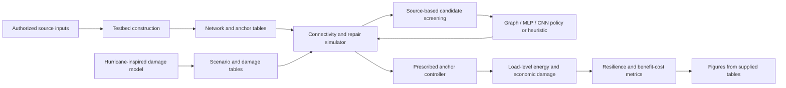

# Architecture

Stable scripts dispatch to the `dc_restoration` package. They select configurations, validate required inputs and choose output locations; library functions implement restoration, learning and the explicitly documented accounting corrections.

| Package | Responsibility |
|---|---|
| `testbed` | Original input pipeline, final benchmark conversion, anchor-zone construction and final benchmark damage sampler |
| `hazards` | Existing track handling, exposure, wind, fragility, damage, repair-time and initial-outage functions |
| `restoration` | Final connectivity simulator, physical metrics, repair-order accounting and input contracts |
| `anchors` | Prescribed support allocation and finite-energy accounting |
| `policies` | Final observation adapter, graph/MLP/CNN architecture definitions, BC/A2C/PPO learning and method registry |
| `evaluation` | Source-based rollouts, bounded GA, resource accounting, trajectory metrics and validated analysis tables |
| `economics` | Duration-based interruption damage, node-level accounting, enablement costs and host-community incidence |
| `plotting` | Final figure functions and explicit input/output dispatch |

The final simulator is the implementation imported by the matched policy-training code. Earlier environment interfaces are not a second supported execution path. The hurricane fragility functions and the final benchmark sampler are distinct pieces of the research lineage; [model scope](model_scope.md) documents their component classes.

Several original files combined reusable functions with complete experiments. The release copies each source first, then retains only the required top-level definitions and their dependencies. File hashes and retained definitions appear in [the manifest](provenance/source_file_manifest.csv). Learning, restoration and allocation numerical logic is preserved. The intentional benefit-cost boundary corrections, authoritative configuration and post-processing interfaces are catalogued in [release refinements](provenance/release_refinements.md).
